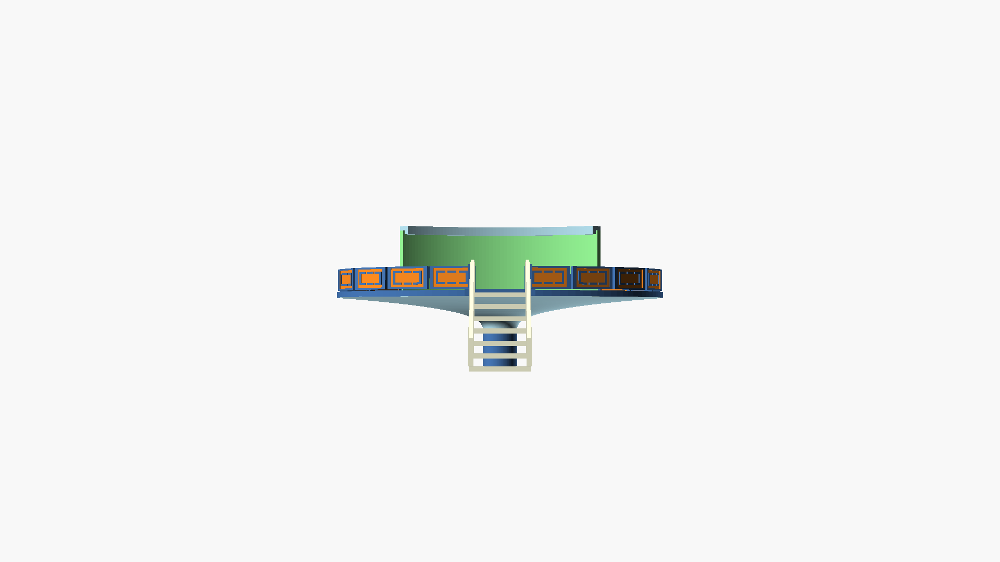

# The Landing Pad

The goal of this project is to produce a ["No Rights Reserved"](https://creativecommons.org/public-domain/cc0/) 3D model
of the [world's first UFO Landing Pad](https://www.stpaul.ca/visitors/ufo-landing-pad), built in 1967 in the town of [St. Paul, Alberta, Canada](https://en.wikipedia.org/wiki/St._Paul,_Alberta)

# 3D Printer

- Model: [Prusa i3 Mk3s](https://www.makerhacks.com/prusa-mk3s-review/)
- Dimentions: 250mm x 210mm x 200mm

# LiDAR scan: 2025-06-13.stl

Using a free trial of [poly.cam](https://poly.cam/) on iPhone I made a LiDAR scan. Seems this is a good way to capture the rocks under the landing pad. The rest of the structure might need to be modeled from scratch, using relative measurements from the scan.

# Photogrammetry: 2025-06-14.stl

This scan is using the camera without LiDAR. As it turns out this is more precise.

# Modeling a section of the fence

See [the older version of this README](https://github.com/notchia/the-landing-pad/blob/9a6d8a2c4053ba86a18f6dbb26d026fb5effaf4c/README.md) for a detailed log of how the fence section was modeled step by step with OpenSCAD and Claude.

