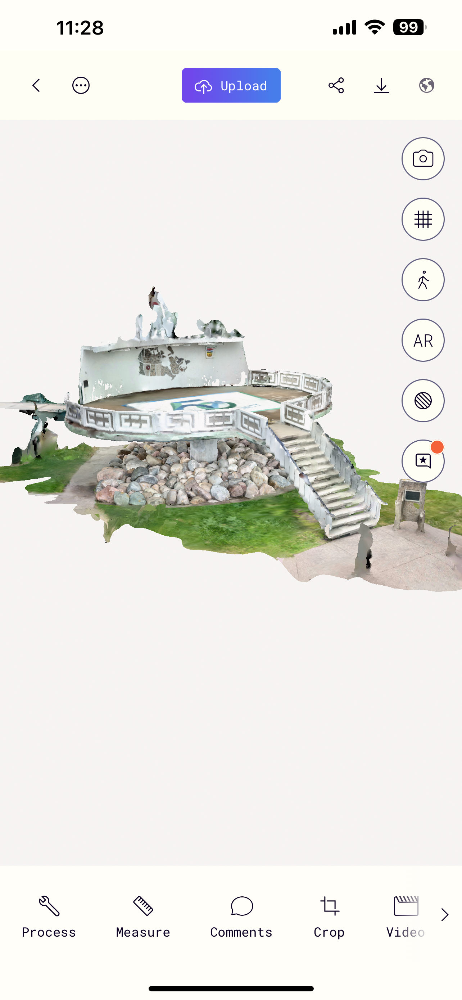
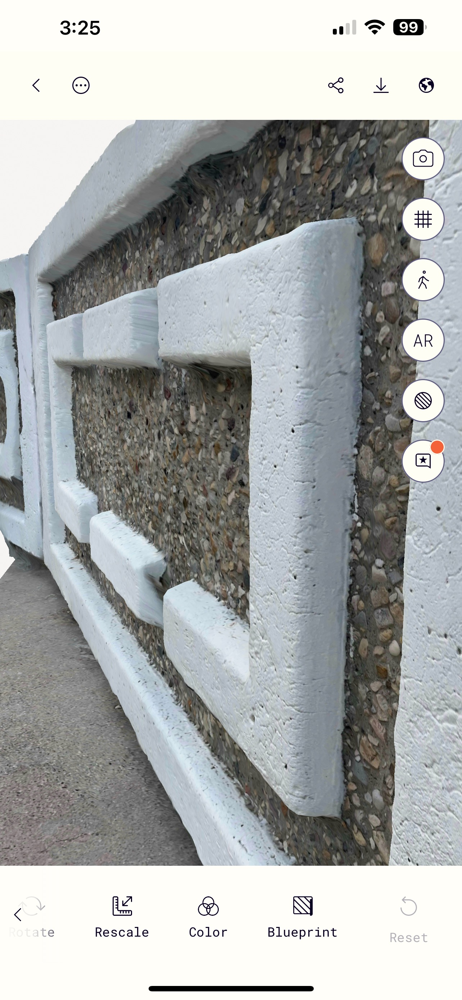
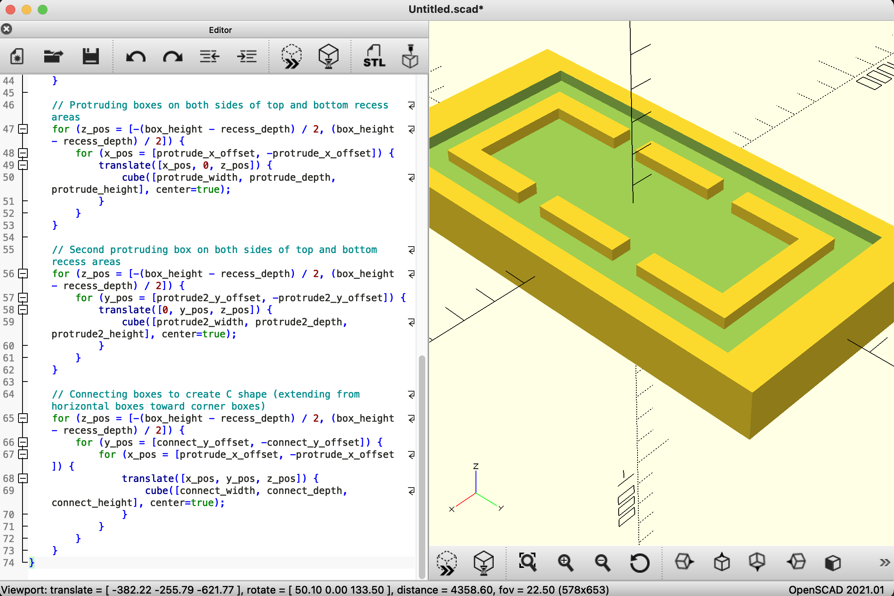

# The Landing Pad

The goal of this project is to produce a [“No Rights Reserved”](https://creativecommons.org/public-domain/cc0/) 3D model
of the [world's first UFO Landing Pad](https://www.stpaul.ca/visitors/ufo-landing-pad), built in 1967 in the town of [St. Paul, Alberta, Canada](https://en.wikipedia.org/wiki/St._Paul,_Alberta)

# 3D Printer

- Model: [Prusa i3 Mk3s](https://www.makerhacks.com/prusa-mk3s-review/)
- Dimentions: 250mm x 210mm x 200mm

# LiDAR scan: 2025-06-13.stl

Using a free trial of [poly.cam](https://poly.cam/) on iPhone I made a LiDAR scan. Seems this is a good way to capture the rocks under the landing pad. The rest of the structure might need to be modeled from scratch, using relative measurements from the scan.

# Photogrammetry: 2025-06-14.stl

This scan is using the camera without LiDAR. As it turns out this is more precise.

# Modeling a section of the fence

I am using Claude 4 Sonnet to generate code in [OpenSCAD](https://openscad.org/) format.

Starting version `cube([725, 1466, 154], center=true);`

> Add a recessed surface on top of this box that is 36 units deep and leaves a bezel that is 61 units wide on the X axis and 127 units wide on the Y axis. Do not hardcode any numbers.

checkpoint 1.

> Use a loop to duplicate the recess on the bottom of the box

checkpoint 2.

> Add a box with dimentions 66, 274, 36 that protrudes from the recessed area. Make it centered on the Y axis. On the X axis, place it so that the distance between it and the end of the recessed area is 86.

checkpoint 3.

> (same chat) Use a loop to make a copy of the protruding box on the opposite side of the recessed area.

checkpoint 4.

> (same chat) Use a loop to copy the protruding boxes to the bottom of the box, with a symmetry along the XY plane

checkpoint 5.

> (same chat) Make another protruding box with dimensions Y=66, Z=36 and taking up as much space as possible on the X axis leaving a distance of 86 to the end of the recessed area.

checkpoint 6.

> (same chat) Now move this new protruding box along the Y axis until the distance between it and the end of the recessed area is 86

checkpoint 7.

> (same chat) Now turn these protruding boxes into a letter C shape by adding a pair of protruding boxes to each of them. They should stretch toward the middle of the shape but leave 86 units of distance to the first set of protruding boxes

checkpoint 8.

